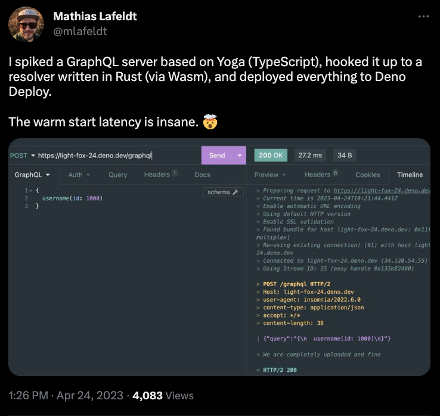

# GraphQL Rust resolvers + Deno Deploy = 🚀

This repo contains the code I spiked to explore the idea of combining a JS-based GraphQL server with resolvers written in Rust (via Wasm), deployed to the edge with Deno Deploy.

Many people asked me to share more details after I [tweeted about it](https://twitter.com/mlafeldt/status/1650461274147368960), so here it is.



## Usage

Build Rust resolvers and start local GraphQL server (requires
[Deno](https://deno.com/manual/getting_started/installation) and [Rust](https://www.rust-lang.org/tools/install) to be
installed):

```console
deno task dev
```

Optionally deploy the server to [Deno Deploy](https://deno.com/deploy) (requires [deployctl](https://deno.com/deploy/docs/deployctl)):

```console
export DENO_DEPLOY_TOKEN=...
export DENO_DEPLOY_PROJECT=...

deno task deploy
```

Test the resolvers with curl:

```console
❯ GRAPHQL_ENDPOINT=https://${DENO_DEPLOY_PROJECT}.deno.dev  # or http://localhost:8000

❯ curl $GRAPHQL_ENDPOINT --json '{"query": "query {username(id: 1234)}"}'
{"data":{"username":"User #1234"}}

❯ curl $GRAPHQL_ENDPOINT --json '{"query": "mutation {counter}"}'
{"data":{"counter":1}}
❯ curl $GRAPHQL_ENDPOINT --json '{"query": "mutation {counter}"}'
{"data":{"counter":2}}
❯ curl $GRAPHQL_ENDPOINT --json '{"query": "mutation {counter}"}'
{"data":{"counter":3}}
```

You can also open the endpoint in a browser for interactive testing with GraphiQL.
